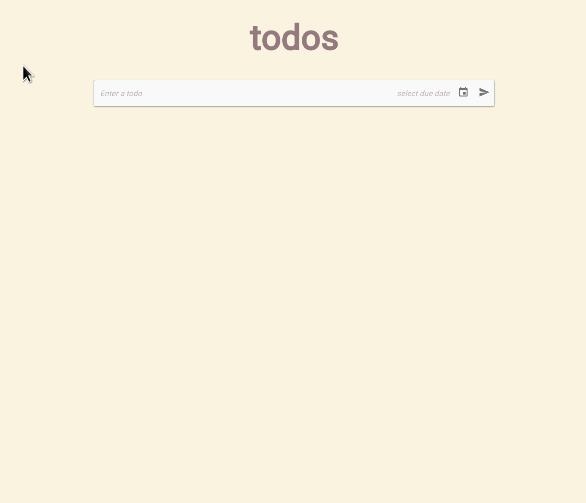

# Todos

This is my implementation of a basic Todo app and can be accessed [here](https://infinite-cove-56536.herokuapp.com/).

## Technologies

This project was developed with Nx workspaces using the following technologies:


- [React](https://reactjs.org)
- [Redux](https://react-redux.js.org/)
- [Redux-Saga](https://redux-saga.js.org/)
- [Express](https://expressjs.com)
- [Node](https://nodejs.org)
- [MongoDB](https://www.mongodb.com/)
- [StyledComponents](https://styled-components.com/)

## Deployment

MongoDB is hosted on Mongo Atlas and the app itself is hosted on Heroku.

## Functionalities

Users can:
- create a todo item by typing in the task and pressing ```Enter``` or using the send button.
- add a due date for a todo item while creating it.
- set a todo item as completed or uncompleted using the toggle on the left of each row.
- edit a todo item by clicking on a task from the list and then the text can be altered.
- edit the due date of each todo
- remove a todo from the list

## Demo

